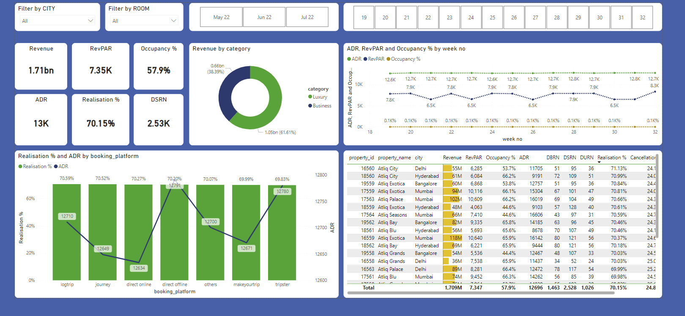

# AltiQ Grands Dashboard (Codebasics Challenge#1)

Domain|Function:  Hospitality|Revenue

## Task Description
AtliQ Grands owns multiple five-star hotels across India. They have been in the hospitality industry for the past 20 years. Due to strategic moves from other competitors and ineffective decision-making in management, AtliQ Grands are losing its market share and revenue in the luxury/business hotels category. As a strategic move, the managing director of AtliQ Grands wanted to incorporate “Business and Data Intelligence” to regain their market share and revenue. However, they do not have an in-house data analytics team to provide them with these insights.

Their revenue management team had decided to hire a 3rd party service provider to provide them with insights from their historical data.

---

## Steps Taken
1. **Upload and Transform Data**: 
   - Imported and transformed the sample data in Power Query to ensure consistency and accuracy.
   - Loaded the transformed data into Power BI for analysis.

2. **Data Modeling**: 
   - Built a robust data model by establishing relationships between fact and dimension tables.
   - Ensured efficient data interaction and streamlined metric calculations.

3. **Measure Creation**: 
   - Developed measures for the required KPIs using DAX to calculate metrics effectively.

4. **Visualization**: 
   - Designed and created visualizations such as tables, cards, and charts to replicate the mock-up and highlight additional insights.

---

## Result
1. The dashboard provides weekly analysis and allows data filtering by city and type of hotel rooms (Elite, Premium, Presidential, Standard).  
2. Key metrics are displayed in an engaging trendline format for clear trend visualization.  
3. A detailed table presents all KPIs grouped by properties within each city, ensuring granular data visibility.  

---

## Dashboard Preview

This dashboard offers a comprehensive view of the data, meeting stakeholder expectations and adding value through additional insights.
